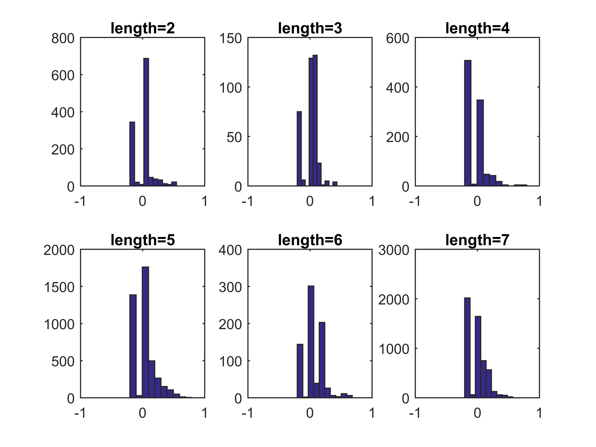

## Evaluation of logical formula length on logical gates' robustness study

In the process of revision, there was an interesting question from one of the reviewers that the authors consider is of interest to the community.
 
The question was on the modifications done on the robustness analysis of logical gates. We build model variants that change one or two logical operators (specifically AND and OR) and the reviewer pointed that some logical rules have more operators than others and, thus, if the process accounts for these differences in some way.

In fact, we did not normalize in any way the effect of changes in the logical rules of different lengths (number of AND and OR operators). We do not expect any systematic bias of the effect of operator mutation with respect to  the length of the rule containing it. Conceptually, a change of a logical operator for us creates a model different from the wild type model by the editing distance one. In this sense, we explore the neighbourhood of the wild type model of radius two editing steps. Obviously, the nodes with longer rules will contribute more to generating model variants, but we do not see a theoretical reason why this should bias a distribution of expected mutation effects on the phenotype. 

In order to make a sanity check, we explicitly verified if there is any systematic bias with respect to the rule length of the effect of a logical operator mutation on the metastasis phenotype. The results of this analysis can be seen in the Excel file LENGTH_EFFECT.xls.  Indeed, we have not seen any clear bias with respect to the rule length.

 Figure 1. Metastatic phenotype probability where one of the modified rule was of a given length.

We explicitly compared the histograms of the distributions of the metastatic phenotype probability where one of the modified rule was of certain length (see file LENGTH_EFFECT.png), and did not find any strong systematic bias. 
Note that these results can be blurred by the fact that some of the nodes characterized by a certain rule length are biologically more sensitive to logical rule changes, and this creates some distinguished peaks in the average effect of logical rule mutations of certain length. 

In our model, this is the case of AKT2 (the only node having the length of the logical rule 6). Mutations in this logical rule frequently leads to increase of Metastasis probability, which creates a peak of average mutation effect for all combinations of the mutation in the rule of length 6 with mutations in rules of other lengths. This effect is much stronger than any hypothetical systematic bias with respect to the rule length, and it is completely justified by biological reasons. 
