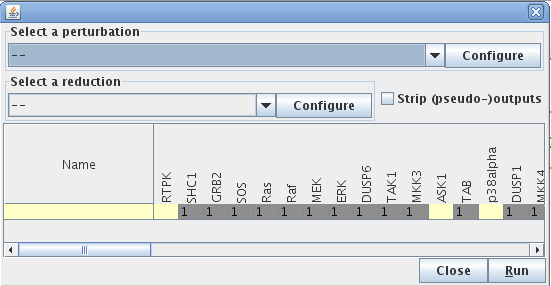
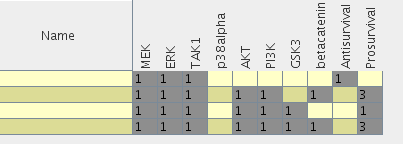
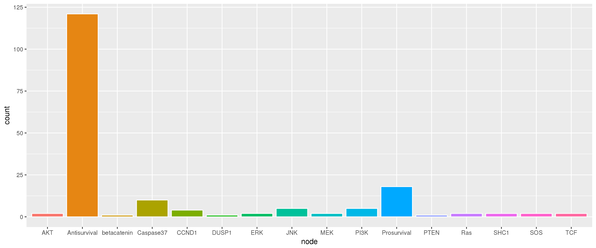
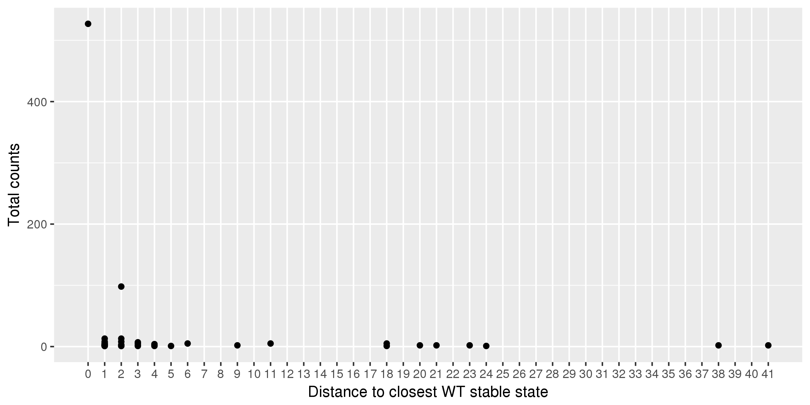
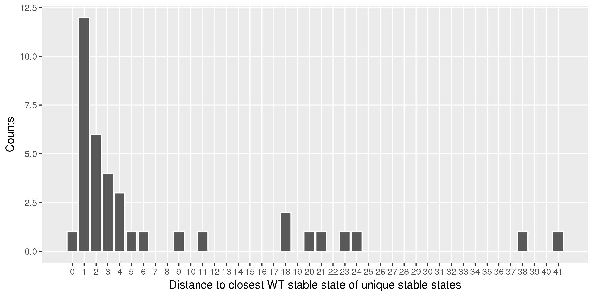

## Application of the logical modelling pipeline on a model of gastric cancer

In this document we apply the proposed pipeline of methods on a logical model published in [Flobak et al, 2015](http://journals.plos.org/ploscompbiol/article?id=10.1371/journal.pcbi.1004426) and available in SBML format. This multilevel model represents the cell fate decision network in the AGS gastric cancer cell line, with 75 signaling and regulatory components. It was built based on background knowledge extracted from literature and databases. The dynamics of the model have been validated by comparing node state predictions against AGS baseline biomarker observations reported in the literature. A reduced version of the model with 10 components was then derived and used to simulate pairwise specific inhibitions of signaling components. Five synergistic combinations were predicted. Finally, four of these five predicted synergies were confirmed in AGS cell growth real-time assays, including known effects of combined MEK-AKT or MEK-PI3K inhibitions, and novel synergistic effects of combined TAK1-AKT or TAK1-PI3K inhibitions.

The model includes two multilevel readout nodes (outputs), named *Prosurvival* and *Antisurvival*, to represent cell fate phenotypes, each taking four values (0, 1, 2, 3).

### 1 - Analysing asymptotic solutions in GINsim

The full model has no input node. Computing its stable states in GINsim returns one stable state, with *Prosurvival*=3 and *Antisurvival*=0.

As said in the original paper describing the model, after reducing the model two nodes (*β-catenin* and *GSK3* ) have no incoming connection as their regulators have been removed, so they become inputs. It is stated in the paper that their values are fixed at either the on-state (*β-catenin*) or off-state (*GSK3*).

However GINsim computes the stable states for all possible input values, and finds 4 stable states that depend on the input values. We can check that active *betacatenin* and inactive *GSK3* correspond to fully activated *Prosurvival* (value 3), which is consistent with the full model.

### 2 - Studying asymptotic solutions stochastically with MaBoSS

The model can be exported into MaBoSS format with GINsim. However, since the model is multivalued and MaBoSS can only simulate Boolean model (states with 0 or 1 values), it has to be *Booleanized* before the export. This step requires to translate each multivalued node in several Boolean nodes. This can be done by hand or with the function automatizing this step in the development version of GINsim (on [http://ginsim.org/downloads](http://ginsim.org/downloads), download the version 2.9.4 of GINsim and open it with `java -jar GINsim-2.9.4.jar --dev`. Once you open GINsim, go to “Tools” and choose “Booleanize model”).

After the *Booleanization* step, the nodes *Prosurvival* and *Antisurvival* have each been split into three Boolean nodes. We can check that the stable states of the reduced model are all conserved:

We can then export the full model into two files Flobak2015_full_bool.bnd and cfg, and the reduced model into two files Flobak2015\_reduced\_bool.bnd and cfg.

We have used Unix to run all appropriate scripts of the present tutorial. We define inputs in listIn.txt (GSK3, betacatenin) and outputs in listOut.txt (*Antisurvival\_b1*, *Antisurvival\_b2*, *Antisurvival\_b3*, *Prosurvival\_b1*, *Prosurvival\_b2*, *Prosurvival\_b3*). These files are then modified with BND\_CFG\_modif.sh, and simulated with run\_MaBoSS\_Unix.sh.

### 3 - Displaying asymptotic solutions using PCA on the stable states

After the simulations, the matrix of stable states for each model is retrieved from the FP output file of MaBoSS run. The script PCA_on_FixedPoints.R can then be used to visualize the stable states as a PCA.

Since only the reduced model has more than one stable state, we have done this analysis on Flobak2015\_reduced\_bool\_fp.csv:

 

### 4 - Displaying asymptotic solutions of MaBoSS results

To display time trajectories and asymptotic solutions, we need to use Flobak2015\_full\_bool\_probtraj_table.csv and Flobak2015\_reduced\_bool\_probtraj\_table.csv with the script `Displaying_asymptotic_solutions.R`.

Time trajectories for the full model are shown below. Among all combinations of values for the output nodes, there is only one possible state at the end of the simulation run, where the three prosurvival nodes are activated. The three other states pictured in the time evolution below have been chosen in order to display transient non-null probabilities as the dynamics converge towards the stable state.

 

The final probabilities for the reduced model simulated with random inputs show the three different states for the considered nodes. They are shown here with the time trajectories:

 
 

As expected, with the inputs betacatenin=1 and GSK3=0, the prosurvival stable state is selected, as we saw in Flobak et al using their initial conditions:

 
 

### 5 - Predicting genetic interactions and robustness analysis

In this section, we perform an analysis of genetic interactions by simulating double mutants, and the robustness of some phenotypes with respect to these mutants.

Let us start with the reduced model, which is faster to simulate. Input values are set to betacatenin=1 and GSK3=0. 

All single and double mutants are generated with `1_generating_mutants.sh` (a total of 128 mutants), and simulated with MaBoSS with `2_running_MaBoSS.sh`. All simulation results are then compiled into a table with `3_results_table_norm.sh`, and finally normalized and analysed with `4_epistasis_study.sh`.

First, we check the epistasis interactions with respect to the single phenotype *Prosurvival\_b2-Prosurvival\_b1-Prosurvival\_b3*. To this end, we use the following command after the normalization step:

	java -Xmx4000M -cp './BiNoM.jar:./VDAOEngine.jar' fr.curie.BiNoM.pathways.MaBoSS.MaBoSSProbTrajFile -makeinter 
	-table Flobak2015_reduced_bool_norm.dat -phenotype "Prosurvival_b2/Prosurvival_b1/Prosurvival_b3" 
	-phenotype_short sumsurv -out Flobak2015_reduced_bool >>epistasis_summary.txt

We find 3 suppressive interactions: ERK\_oe-MEK\_ko, TAK1\_ko-betacatenin\_ko and p38alpha\_oe-betacatenin\_ko (in the file Flobak2015\_reduced\_bool\_sumsurv\_edges\_selected.txt, restricted to the significant scores with an absolute value greater than 1). In each of these interactions, the inactivation of the phenotype caused by the second perturbation of the pair is suppressed by the first perturbation. Therefore these are mechanisms of resistance with survival rescue.

We can then exploit the possibility of combining phenotypes by grouping on the one hand all phenotypes with a global pro-survival value (*Prosurvival*-*Antisurvival*>0), and on the other hand all phenotypes with a global anti-survival value (*Prosurvival*-*Antisurvival*<0). 

This is done with the option -mergedphenotypes in:

	java -cp './BiNoM.jar:./VDAOEngine.jar' fr.curie.BiNoM.pathways.MaBoSS.MaBoSSProbTrajFile -normtable 
	-mergedphenotypes "Antisurvival=Antisurvival_b1+Antisurvival_b2/Antisurvival_b1+Antisurvival_b2/Antisurvival_b1/Antisurvival_b3+Antisurvival_b2/Antisurvival_b1/Antisurvival_b3/Prosurvival_b1+Antisurvival_b2/Antisurvival_b1/Antisurvival_b3/Prosurvival_b2/Prosurvival_b1+Antisurvival_b2/Antisurvival_b1/Prosurvival_b1;
	Prosurvival=Prosurvival_b1+Antisurvival_b1/Prosurvival_b2/Prosurvival_b1+Antisurvival_b1/Prosurvival_b2/Prosurvival_b1/Prosurvival_b3+Antisurvival_b2/Antisurvival_b1/Prosurvival_b2/Prosurvival_b1/Prosurvival_b3+Prosurvival_b2/Prosurvival_b1+Prosurvival_b2/Prosurvival_b1/Prosurvival_b3" 
	-table Flobak2015_reduced_bool.xls

The epistatic scores corresponding to these two grouped phenotypes are computed with:

	java -Xmx4000M -cp './BiNoM.jar:./VDAOEngine.jar' fr.curie.BiNoM.pathways.MaBoSS.MaBoSSProbTrajFile -makeinter 
	-table Flobak2015_reduced_bool_norm.dat -phenotype Prosurvival 
	-phenotype_short surv -out Flobak2015_reduced_bool >>epistasis_summary.txt

	java -Xmx4000M -cp './BiNoM.jar:./VDAOEngine.jar' fr.curie.BiNoM.pathways.MaBoSS.MaBoSSProbTrajFile -makeinter 
	-table Flobak2015_reduced_bool_norm.dat -phenotype Antisurvival 
	-phenotype_short antisurv -out Flobak2015_reduced_bool >>epistasis_summary.txt

* Looking at Pro-survival phenotypes:

Looking at the significant scores for this grouped pro-survival phenotype (file Flobak2015\_reduced\_bool\_surv\_edges\_selected.txt), we now find 3 synthetic interactions in addition to the 3 suppressive interactions found previously: p38alpha\_oe-PI3K\_ko, ERK\_ko-AKT\_ko, and TAK1\_ko-PI3K\_ko. These pairs of mutants have synergistic effects: each single mutant does not affect the WT probability (this remains 1), but the double mutant diminishes this probability to 0.3.

We use the script `Analyses_of_genetic_interactions.R` to compute the PCA for all single phenotypes with a pro-survival value (A=*Antisurvival*, P=*Prosurvival*), showing the mutants from the epistatic pairs found for the grouped pro-survival phenotypes (see figure below). As expected, all three double mutants corresponding to suppressive interactions overlap with the WT point, as well as one single mutant from each pair. The epistatic scores for these interactions are proportional to the distances between this point and the point corresponding to the second single mutant in each pair.

In contrast, synthetic interactions correspond to non-overlapping points for single and double mutants.

 

* Looking at Anti-survival phenotypes:

Moreover, we find 5 interactions with respect to the grouped anti-survival phenotypes. 4 are non-interactive interactions (AKT\_oe-betacatenin\_ko, TAK1\_ko-betacatenin\_ko, GSK3\_oe-betacatenin\_ko, p38alpha\_oe-betacatenin\_ko): although betacatenin_ko alone activates the anti-survival phenotypes, it has no effect in pair with the other perturbation, which can be interpreted as a resistance mechanism. The last interaction is double-nonmonotonic (ERK\_ko-AKT\_ko): none of the single perturbation has an effect on the grouped anti-survival phenotype, but in pair it becomes partially activated.

First, we can note that three interactions (ERK\_ko-AKT\_ko, TAK1\_ko-betacatenin\_ko and p38alpha\_oe-betacatenin\_ko) are found significant for both anti- and pro-survival phenotypes, but with very different genetic interaction type of relationship (for instance, in the case of p38alpha\_oe-betacatenin\_ko they are suppressive for pro-survival and non-interactive in anti-survival).

The figure below shows the PCA for all single phenotypes with an anti-survival value (A=*Antisurvival*, P=*Prosurvival*), with mutants from the epistatic pairs found for grouped anti-survival phenotypes. Non-interactive interactions are characterized by double mutants overlapping with the WT point, with inactivated anti-survival phenotypes, along with one single mutant per pair, while the other single mutant alone is apart (betacatenin\_ko in each case). In contrast, the position of the double-nonmonotonic interaction shows that the corresponding double mutation activates the phenotype A3-P2 (*Antisurvival\_b3-Prosurvival\_b2*).

 

* Looking at both grouped phenotypes:

For this model, PCA plots are actually not the best way to visualize different mutants groups, because single phenotypes are not independent. Since single phenotypes have been grouped, it is easier to plot the normalized probabilities for all mutants for these two groups of phenotypes, as seen below. Mutants involved in all epistatic pairs have been labelled. Moreover, double mutants that result in small probabilities for *Prosurvival* phenotype have been labelled in blue. It can be seen that when the different phenotypic values of the two groups are plotted, the mutants are better differentiated: most single mutants stay close to the WT point, while only betacatenin\_ko confers a high anti-survival probability. Double mutants are then separated in pairs led by betacatenin\_ko, or in resistant pairs. Double mutants that are associated with low pro-survival probability without including betacatenin_ko all correspond to synthetic interactions.

 

In [Flobak et al 2015](http://journals.plos.org/ploscompbiol/article?id=10.1371/journal.pcbi.1004426), the synergistic effect of some inhibitions was assessed by simulating the reduced model with synchronous updatings. Therefore, we can compare our results for the grouped pro-survival phenotype with the 5 synergistic pairs found in [Flobak et al 2015](http://journals.plos.org/ploscompbiol/article?id=10.1371/journal.pcbi.1004426): TAK1\_ko-PI3K\_ko, TAK1\_ko-AKT\_ko, MEK\_ko-AKT\_ko, MEK\_ko-PI3K\_ko and p38alpha\_ko-MEK\_ko.

One synergistic pair that Flobak et al authors studied (TAK1\_ok-PI3K\_ko) has been found in present analysis, while the other 2 interactions that we have found were not been studied in the paper. Moreover, looking at the interactions with less significant scores (in Flobak2015\_reduced\_bool\_surv\_edges.txt) we can find 2 other synergistic interactions studied by the paper authors. These interactions have a smaller effect on the probability of the grouped phenotype (Prosurvival=0.69 for MEK\_ko-PI3K\_ko and Prosurvival= 0.74 for MEK\_ko-AKT\_ko).

However, TAK1\_ko-AKT\_ko and p38alpha\_ko-MEK\_ko have no synergistic effect on our grouped phenotypes: their probability remains 1 in each case. This comes from the merging of single phenotypes into a single grouped phenotype, where each single phenotype has the same weight. For instance, *Prosurvival\_b2-Prosurvival\_b1-Prosurvival\_b3* which is the stable state for TAK1\_ko is merged with *Antisurvival\_b2-Antisurvival\_b1-Prosurvival\_b2-Prosurvival\_b1-Prosurvival\_b3* which is the stable state for *TAK1\_ko-AKT\_ko*. 

To obtain a grouped phenotype that is more relevant to this case study, we performed a manual merging of single phenotypes into a phenotype *Growth* that corresponds to the difference of "Prosurvival -- Antisurvival", normalized between 0 and 1. 

The probability of *Growth* is therefore 1 for TAK1\_ko and 0.667 for TAK1\_ko-AKT\_ko. Synergistic interactions computed with respect to this grouped phenotype now include all 5 pairs of mutants identified in [Flobak et al 2015](http://journals.plos.org/ploscompbiol/article?id=10.1371/journal.pcbi.1004426). Probabilities for the phenotype *Growth *are shown here below for the most significant epistatic scores.  Three synergistic pairs of these five (TAK1\_ko-AKT\_ko, p38alpha\_ko-MEK\_ko and TAK1\_ok-PI3K\_ko) can be seen on the figure.

 

The pipeline then includes the mutants variability and robustness of genetic interactions with `Analyses_of_genetic_interactions.R`. The histograms of probabilities for the grouped pro-survival and anti-survival phenotypes can be found below. It can be interpreted as the projection of the scatterplot above where each axis was the normalized probability for all mutants for these two groups of phenotypes.

 
 

The histogram of probabilities for our custom grouped phenotype Growth shows more variation:

 

* Looking at the full model:

Finally, we can check that results are similar with the full model. To reduce the computation time, we have only considered the perturbation of nodes that were also present in the reduced model.

We find the same significant epistatic interactions in the full model as in the reduced model with respect to the grouped pro-survival phenotype as well as the custom Growth phenotype. Moreover, more epistatic interactions are found with respect to the grouped anti-survival phenotype or with single phenotypes such as *Prosurvival\_b2-Prosurvival\_b1-Prosurvival\_b3*. 

Plotting the normalized probabilities for all mutants for the two pro- and anti-survival grouped phenotypes with the same labels as for the reduced model, below, shows that the results are roughly the same with only slight differences.

 

There is a bit more variation of the probabilities for the grouped phenotype *Growth* across the double mutants (see histogram below). The full model is therefore slightly less robust but more flexible than the reduced model, surely due to its increased number of nodes.

 

### 6 - Robustness analysis of logical gates

To study the robustness of the stable states with respect to logical gates variations, pairs of modifications of logical gates are systematically introduced to each logical rule with the following command (see `1_generating_variants.sh`):

	java -cp ./BiNoM.jar fr.curie.BiNoM.pathways.MaBoSS.MaBoSSBNDFile -c ./Flobak2015_reduced_bool.cfg 
	-b ./Flobak2015_reduced_bool.bnd -level 2

This generates 5152 variants for the 11 rules that are composed of one or several logical gates (associated with the nodes AKT, Antisurvival\_b1, Antisurvival\_b2, Antisurvival\_b3, ERK, MEK, p38alpha, PI3K, Prosurvival\_b1, Prosurvival\_b2, Prosurvival\_b3).

Simulations of all variants are run in MaBoSS with `2_running_MaBoSS.sh`, and the results are compiled into a table with `3_results_table_norm.sh`. Finally, robustness analysis of logical gates with respect to some phenotype probability can be done with `Analyses_of_logical_gates.R`.

The histogram below shows that the probabilities of the single-state phenotype *Prosurvival\_b2-Prosurvival\_b1-Prosurvival\_b3* (which is the WT stable state) are affected only in a few cases by varying the logical gates, i.e. this stable state is extremely robust:

 

The nodes affected in the few logical mutants that result in a final probability below 0.3 for *Prosurvival\_b2-Prosurvival\_b1-Prosurvival\_b3* are plotted as an histogram below. On the first figure, modifications of logical rules for Prosurvival\_b1, Prosurvival\_b2 or Prosurvival\_b3 have been grouped together, as well as Antisurvival\_b1, Antisurvival\_b2 or Antisurvival\_b3. On the second figure, they have been removed to focus on the other variants.

 
 

Beside the output nodes, alterations of the regulations of AKT and PI3K are more likely to alter the phenotype.

There are 5674 stable states reached for all logical gate mutants, but only 10 unique stable states. Below, we plot the Hamming distance of all the variants’ stable states (left) or unique stable states (right) to the stable state of the wild type. In 80% of the cases, a stable state reached by the mutated model is the wild type stable state (distance=0). This denotes a strong robustness of the reduced model with respect to variations of logical gates.

 
 

Applying the same procedure to the full model generates only 713 variants. Indeed, although there are 50 nodes defined by logical rules composed of one or several logical gates, these logical rules are much less complex than the the reduced model one.

The probabilities of *Prosurvival\_b2-Prosurvival\_b1-Prosurvival\_b3* are again robust to variations of the logical gates, as shown below:

 

However, looking at the nodes affected in logical mutants that result in a final probability below 0.3 for *Prosurvival\_b2-Prosurvival\_b1-Prosurvival\_b3* reveals much more diversity. Note that modifications of logical rules for Prosurvival\_b1, Prosurvival\_b2 or Prosurvival\_b3 have been grouped together, as well as Antisurvival\_b1, Antisurvival\_b2 or Antisurvival\_b3:

Most cases come from altering the regulations of the outputs (*Antisurvival* or *Prosurvival*). The same histogram without the output nodes, below, allows to see more clearly the other variants:

We can note that the logical rule defining the regulation of Caspase37 is particularly sensitive. 

As for stable states reached by the variants, since the full model counts 83 nodes, it allows for more variability than for the reduced model. Indeed, we find 38 unique stable states. Below, we plot the Hamming distance of all the variants’ stable states (top) or unique stable states (bottom) to the stable state of the wild type.

The mutated models still reach the wild type stable state (distance=0) in 70% of the cases, showing a good robustness. However, some stable states are very different from the wild type phenotype. In particular, two stable states have distance of 38 and 41. They correspond to single modifications of the logical rules of TCF and betacatenin.

### Conclusion

We hereby present the use of the set of tools developed in present paper on a model that we have obtained from literature. Overall, these analyses have allowed us to deeply characterize the properties of the model published by Flobak et al. 

We have found the different stable states that they present in their work and we have used PCA to help visualize the correspondence between variables and the asymptotic solutions. Using MaBoSS we have seen that these stable states do not have equal probabilities of being reached and that, in the case of the full model, transient effects can be found on some states. We have also found epistatic relationships from its components, some already described on Flobak et al paper and some new interactions. Finally, we have seen that the model is quite robust on its logical rules on both models, the full and the reduced.