Tutorial on logical model simulation

[[TOC]]

## Material and methods we are going to use

Cytoscape network file (for data integration)

GINSim model file

Executables (downloads or links to downloads): GINSim, OCSANA, MaBoSS, Cytoscape, BiNoM, ViDaExpert, ROMA

Scripts: list 

## Constructing the Metastasis model network

The desired level of description of the processes we wish to explore directs the choice of the type of networks that is most appropriate to the biological question. If the biochemistry is well known, biochemical reaction-based networks will be used. If only activation or inhibition of one protein onto the other is known without the details of the influences, then an influence network will be built.

To build our networks, we conform to the standard rules of the community, SBGN [ref], which are of three kinds: Entity Relations (ER), Process Diagrams (PD) and Activity Flow (AF). Over the years, we have been using mainly ER when the information was not very detailed and PD for cases where mechanistic processes were needed to answer the biological question (cf. ACSN). 

In the particular case of this article, the ER process started by gathering information on the signalling pathway of interest: migration and ER-related ones on one side and apoptosis-related on the other. We gathered information on the relevant players of these pathways and how they were related: which protein activated which proteins and how they accomplished their signalling goals. Usually researchers find themselves in a situation were different papers yields contradictory information on a given element of the network. In this case, both caution and annotation are key. Some interactions that might not make sense on the close-up view might reveal their rationale when more information about the context is added to the picture.

### Metastasis model as a test case

We will use a model developed in our group that describes the signalling and regulation of EMT and Metastasis in cancer cells. This model is comprised of 32 nodes and 157 edges; has two inputs, *ECMicroenv* and *DNAdamage* and six outputs: *ECM*, *Invasion*, *Migration*, *Metastasis*, *Apoptosis *and *CellCycleArrest*.

The model is able to predict conditions, e.g. single or double mutations, favourable (or unfavourable) to tumour invasion and migration to the blood vessels in response to two inputs, extracellular matrix signalling (*ECMicroenv*) and DNA damage presence (*DNAdamage*). 

The gene-wise model

The module-wise model

We have bundled some of the genes in functional modules in order to test several techniques that we will describe in present work. The pathways included in this model are represented by one or two components of these pathways, e.g TGFB1 and SMADs for *TGFbeta*, Twist1, Snai1, Snai2, Zeb1, Zeb2 and Vim for *EMT*, miR203, miR200 and miR34a for *miRNA*, etc. 

This model has been the object of continuous work from several researchers who have gathered data from literature and have thoroughly validated it with experiments and single and double mutant data [ref]. 

In this model, no cyclic attractors were found for the wild type cases.

## Structural analysis of the model

We will start with a model build on GINsim. In this tool, we can export the network into Cytoscape format. Once we have done that we are able to import it in Cytoscape.

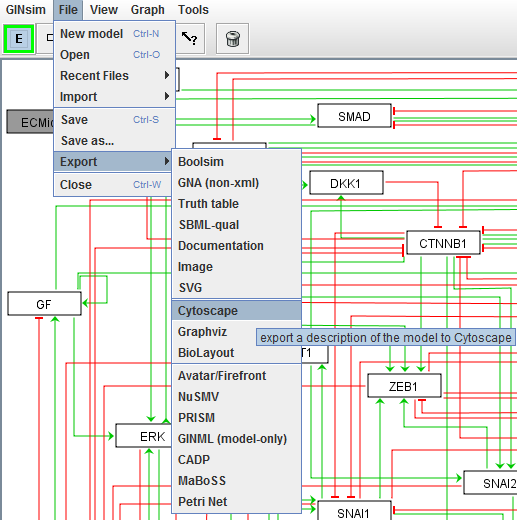

To perform OCSANA Analysis go to Cytoscape 2.X, look for `Plugins menu / BiNoM / BiNoM Analysis / OCSANA Analysis`.

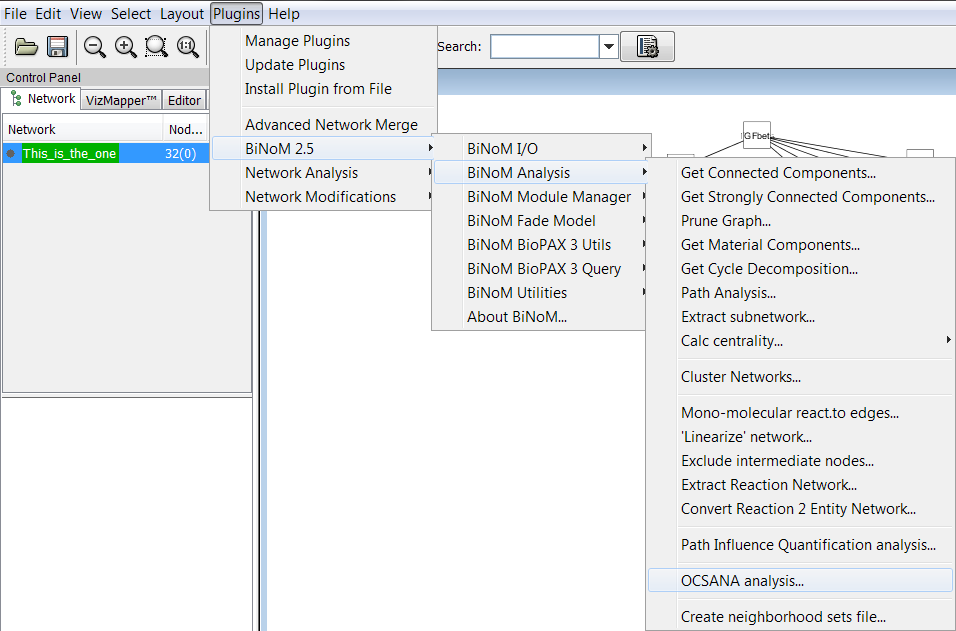
<!---  --->

A window pops up where you can select the source node (*ECMicroenv* in our case study) and target node (*Metastasis* in our case study) for which you want to study the shortest paths.

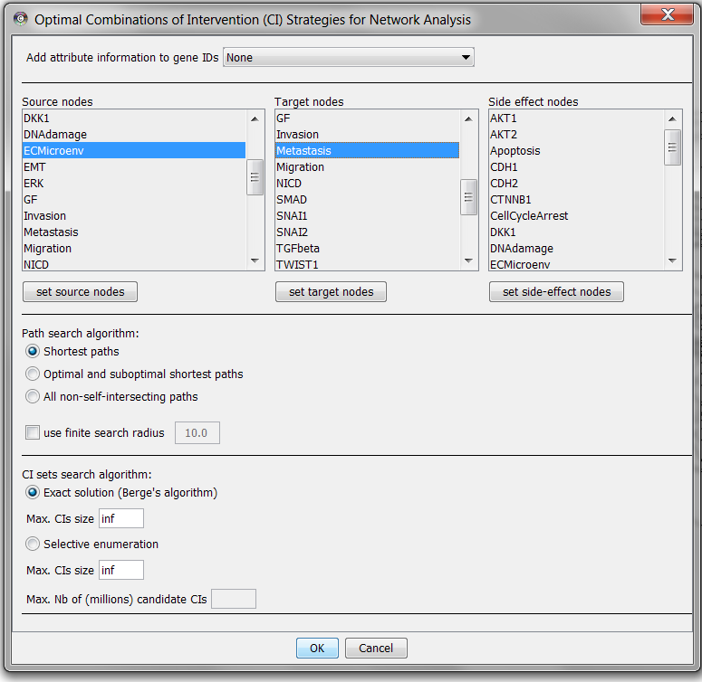

This generates a report that can be copied to clipboard , saved or also visualized in Cytoscape as a subnetwork of the original network.

This report can be exported in a text file and have a structure such as follows:

	--- Optimal Combinations of Interventions Report ---

First, a part where the options are detailed:

	OPTIONS
	Source nodes: ECMicroenv 
	Target nodes: Metastasis 
	Side effect nodes: 	
	Path search algorithm: Shortest paths
	Finite search radius for All non-intersecting paths: inf
	CI algorithm selected: Exact solution (Berge's algorithm)

Second, an explanation of the results:

	RESULTS
	Modifications to the network: 0 undefined effect edges were converted to activation effect edges out of 157
	Found 6 elementary paths and 8 elementary nodes
	ECMicroenv -> NICD -> AKT2 -> Migration -> Metastasis
	ECMicroenv -> TGFbeta -> AKT2 -> Migration -> Metastasis
	ECMicroenv -> NICD -| p63 -| Migration -> Metastasis
	ECMicroenv -> NICD -> AKT1 -| Migration -> Metastasis
	ECMicroenv -> TGFbeta -> AKT1 -| Migration -> Metastasis
	ECMicroenv -> NICD -> ERK -> Migration -> Metastasis

Those are the 6 elementary paths that include 8 nodes that connect *ECMicroenv* with *Metastasis*. These are activating as well as inhibiting paths.

Total timing for the search: 0 sec.

Found 5 optimal CIs

<table>
  <tr>
    <td>Optimal CI</td>
    <td>Size</td>
    <td>OCSANA score of the CI sets</td>
    <td>xi/x*|EFFECT_ON_TARGETS|*SET score of the whole CI set</td>
    <td>yi/y*SIDE-EFFECT*SET of the whole CI set</td>
  </tr>
  <tr>
    <td>[Migration]</td>
    <td>1</td>
    <td>6</td>
    <td>6</td>
    <td>0</td>
  </tr>
  <tr>
    <td>[AKT1, NICD, AKT2]</td>
    <td>3</td>
    <td>4,667</td>
    <td>4,667</td>
    <td>0</td>
  </tr>
  <tr>
    <td>[ECMicroenv]</td>
    <td>1</td>
    <td>3</td>
    <td>3</td>
    <td>0</td>
  </tr>
  <tr>
    <td>[AKT1, p63, ERK, AKT2]</td>
    <td>4</td>
    <td>3</td>
    <td>3</td>
    <td>0</td>
  </tr>
  <tr>
    <td>[TGFbeta, NICD]</td>
    <td>2</td>
    <td>2,667</td>
    <td>2,667</td>
    <td>0</td>
  </tr>
</table>

**XXX Explanation of CIs**

OCSANA Score for each elementary node:

<table>
  <tr>
    <td>Elementary node</td>
    <td>OCSANA score</td>
  </tr>
  <tr>
    <td>AKT2</td>
    <td>1</td>
  </tr>
  <tr>
    <td>ERK</td>
    <td>0,5</td>
  </tr>
  <tr>
    <td>p63</td>
    <td>0,5</td>
  </tr>
  <tr>
    <td>ECMicroenv</td>
    <td>3</td>
  </tr>
  <tr>
    <td>NICD</td>
    <td>2,667</td>
  </tr>
  <tr>
    <td>AKT1</td>
    <td>1</td>
  </tr>
  <tr>
    <td>TGFbeta</td>
    <td>0</td>
  </tr>
  <tr>
    <td>Migration</td>
    <td>6</td>
  </tr>
</table>

**XXX Explanation of nodes’ score**

EFFECT\_ON\_TARGETS x SET Score matrix (rows = elementary nodes x columns = target nodes):

<table>
  <tr>
    <td>Elementary node / Target node</td>
    <td>Metastasis</td>
  </tr>
  <tr>
    <td>AKT2</td>
    <td>1</td>
  </tr>
  <tr>
    <td>ERK</td>
    <td>0,5</td>
  </tr>
  <tr>
    <td>p63</td>
    <td>-0,5</td>
  </tr>
  <tr>
    <td>ECMicroenv</td>
    <td>3</td>
  </tr>
  <tr>
    <td>NICD</td>
    <td>2,667</td>
  </tr>
  <tr>
    <td>AKT1</td>
    <td>-1</td>
  </tr>
  <tr>
    <td>TGFbeta</td>
    <td>0</td>
  </tr>
  <tr>
    <td>Migration</td>
    <td>6</td>
  </tr>
</table>

**XXX Explanation of effects on targets**

Globally, these results can be interpreted as follows: 

**XXX [TO DO]**

Finally, the set of shortest paths can be seen right away in Cytoscape.

<!------> 

## Translation of the network into a mathematical model

The network has been built with connections among nodes describing the kind of interaction that they have and these have been described in the annotation box of each node.  This information can be traced, updated and corrected at any time.

GINsim can inform easily on all stable states of the model, the functionality of positive and negative circuits, or propose reduced models. 

GINsim can easily find and show all stable states:

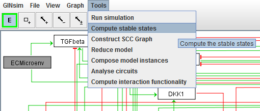

And generate a truth table of this kind:

GINsim can also find all positive and negative circuits. For this we will use the reduced model obtained in the process explained in the "Model reduction" part and also in [ref]. The reason for this is that GINsim cannot deal with the functionality analysis of the original model:

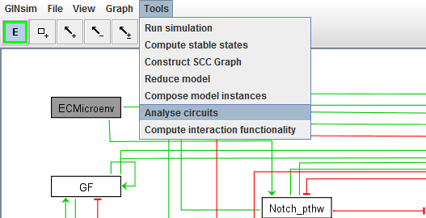

A window pops up:

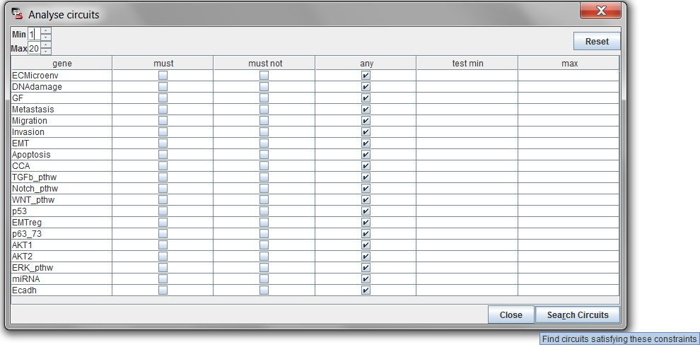

**XXX Differences of *must*, *must not* and *any*??**

And *Search Circuits* retrieves:

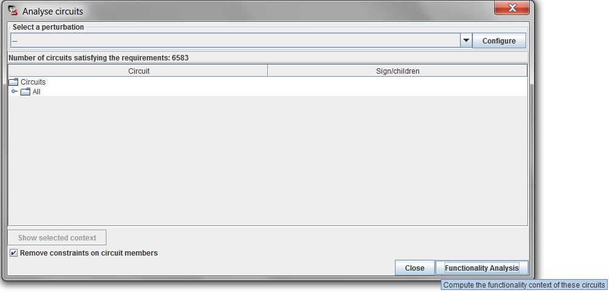

Here researchers can perform a *Functionality Analysis* of wild type strain in order to analyse its functional circuits, and retrieve a window such as:

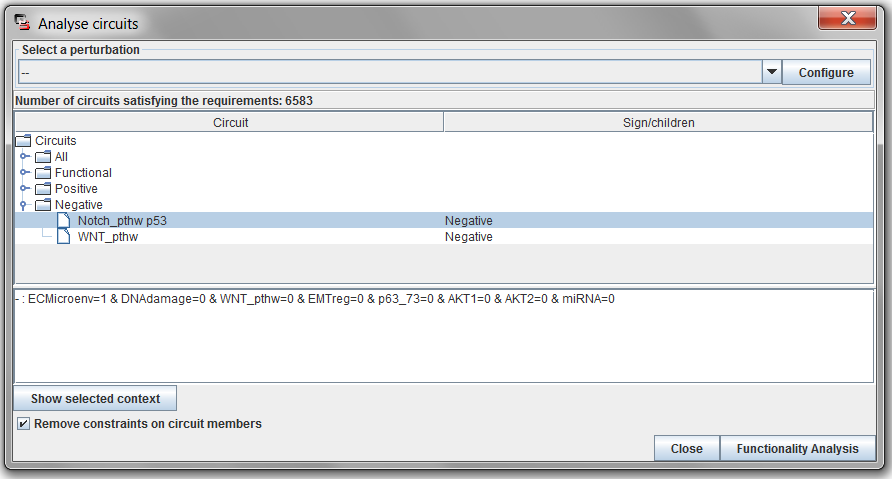

Where Positive and Negative circuits can be browsed and studied. The latter is especially interesting to detect and analyse limit cycles, that are usually caused by feedback loops.

This analysis can also be performed on strains with a given perturbation, such as knock outs (KO) and overexpression (E1), or a combination of perturbations:

This way, we can browse if a given perturbation causes that the system doesn’t display limit cycles. **XXX example of a feedback that only appears/disappears with a given perturbation.**

We have used MaBoSS software as our goal was to simulate our logical model using discrete time Markov chain. In order to do this, we can take advantage of GINsim export ability to build the files that MaBoSS needs to simulate: BND and CFG files.

GINsim export in MaBoSS format:

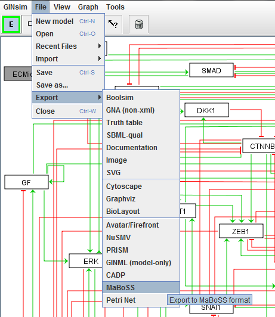 

Models from GINsim can be exported in MaBoSS format. Two files are created: a BND file with the description of the network and its connections among nodes and a CFG file with the configuration parameters needed for the simulations.

## Analysing stable solutions

### Principal component analysis

From GINsim, we can obtain a table of stable states that displays all possible combinations of system’s inputs and its stable outputs:  

This table can be analysed and studied as it is, even more if the model is small-scale and the researcher has a deep knowledge of it. Furthermore, other exploratory analyses can be applied on these results, such as Principal Component Analysis, (PCA). To do this, we need to obtain the table of stable states as a matrix, which can be obtained from the FP output file of MaBoSS run. PCa can then be applied to this matrix in order to identify with variable changes (node’s values in our case) causes that model states change from one stable solution to another. 

In our case, the matrix is:

<table>
  <tr>
    <td>FP</td>
    <td>#1</td>
    <td>#2</td>
    <td>#3</td>
    <td>#4</td>
    <td>#5</td>
    <td>#6</td>
    <td>#7</td>
    <td>#8</td>
    <td>#9</td>
  </tr>
  <tr>
    <td>Probability</td>
    <td>0.2435</td>
    <td>0.12398</td>
    <td>0.13036</td>
    <td>0.1148</td>
    <td>0.11936</td>
    <td>0.01152</td>
    <td>0.002</td>
    <td>0.24744</td>
    <td>0.007</td>
  </tr>
  <tr>
    <td>ECMicroenv</td>
    <td>0</td>
    <td>0</td>
    <td>0</td>
    <td>1</td>
    <td>1</td>
    <td>0</td>
    <td>0</td>
    <td>1</td>
    <td>1</td>
  </tr>
  <tr>
    <td>DNAdamage</td>
    <td>0</td>
    <td>1</td>
    <td>1</td>
    <td>1</td>
    <td>1</td>
    <td>0</td>
    <td>1</td>
    <td>0</td>
    <td>1</td>
  </tr>
  <tr>
    <td>Migration</td>
    <td>0</td>
    <td>0</td>
    <td>0</td>
    <td>0</td>
    <td>0</td>
    <td>0</td>
    <td>0</td>
    <td>1</td>
    <td>1</td>
  </tr>
  <tr>
    <td>Metastasis</td>
    <td>0</td>
    <td>0</td>
    <td>0</td>
    <td>0</td>
    <td>0</td>
    <td>0</td>
    <td>0</td>
    <td>1</td>
    <td>1</td>
  </tr>
  <tr>
    <td>VIM</td>
    <td>0</td>
    <td>0</td>
    <td>0</td>
    <td>0</td>
    <td>0</td>
    <td>1</td>
    <td>1</td>
    <td>1</td>
    <td>1</td>
  </tr>
  <tr>
    <td>AKT2</td>
    <td>0</td>
    <td>0</td>
    <td>0</td>
    <td>0</td>
    <td>0</td>
    <td>1</td>
    <td>1</td>
    <td>1</td>
    <td>1</td>
  </tr>
  <tr>
    <td>ERK</td>
    <td>0</td>
    <td>0</td>
    <td>0</td>
    <td>0</td>
    <td>0</td>
    <td>1</td>
    <td>1</td>
    <td>1</td>
    <td>1</td>
  </tr>
  <tr>
    <td>miR200</td>
    <td>0</td>
    <td>1</td>
    <td>1</td>
    <td>1</td>
    <td>1</td>
    <td>0</td>
    <td>0</td>
    <td>0</td>
    <td>0</td>
  </tr>
  <tr>
    <td>AKT1</td>
    <td>0</td>
    <td>0</td>
    <td>0</td>
    <td>0</td>
    <td>0</td>
    <td>0</td>
    <td>0</td>
    <td>0</td>
    <td>0</td>
  </tr>
  <tr>
    <td>EMT</td>
    <td>0</td>
    <td>0</td>
    <td>0</td>
    <td>0</td>
    <td>0</td>
    <td>1</td>
    <td>1</td>
    <td>1</td>
    <td>1</td>
  </tr>
  <tr>
    <td>Invasion</td>
    <td>0</td>
    <td>0</td>
    <td>0</td>
    <td>0</td>
    <td>0</td>
    <td>0</td>
    <td>0</td>
    <td>1</td>
    <td>1</td>
  </tr>
  <tr>
    <td>p63</td>
    <td>0</td>
    <td>1</td>
    <td>0</td>
    <td>1</td>
    <td>0</td>
    <td>0</td>
    <td>0</td>
    <td>0</td>
    <td>0</td>
  </tr>
  <tr>
    <td>SMAD</td>
    <td>0</td>
    <td>0</td>
    <td>0</td>
    <td>0</td>
    <td>0</td>
    <td>0</td>
    <td>0</td>
    <td>1</td>
    <td>1</td>
  </tr>
  <tr>
    <td>CDH2</td>
    <td>0</td>
    <td>0</td>
    <td>0</td>
    <td>0</td>
    <td>0</td>
    <td>1</td>
    <td>1</td>
    <td>1</td>
    <td>1</td>
  </tr>
  <tr>
    <td>CTNNB1</td>
    <td>0</td>
    <td>0</td>
    <td>0</td>
    <td>0</td>
    <td>0</td>
    <td>0</td>
    <td>0</td>
    <td>0</td>
    <td>0</td>
  </tr>
  <tr>
    <td>CDH1</td>
    <td>1</td>
    <td>1</td>
    <td>1</td>
    <td>1</td>
    <td>1</td>
    <td>0</td>
    <td>0</td>
    <td>0</td>
    <td>0</td>
  </tr>
  <tr>
    <td>p53</td>
    <td>0</td>
    <td>0</td>
    <td>1</td>
    <td>0</td>
    <td>1</td>
    <td>0</td>
    <td>0</td>
    <td>0</td>
    <td>0</td>
  </tr>
  <tr>
    <td>p73</td>
    <td>0</td>
    <td>1</td>
    <td>0</td>
    <td>1</td>
    <td>0</td>
    <td>0</td>
    <td>0</td>
    <td>0</td>
    <td>0</td>
  </tr>
  <tr>
    <td>miR34</td>
    <td>0</td>
    <td>0</td>
    <td>0</td>
    <td>0</td>
    <td>0</td>
    <td>0</td>
    <td>0</td>
    <td>0</td>
    <td>0</td>
  </tr>
  <tr>
    <td>ZEB2</td>
    <td>0</td>
    <td>0</td>
    <td>0</td>
    <td>0</td>
    <td>0</td>
    <td>1</td>
    <td>1</td>
    <td>1</td>
    <td>1</td>
  </tr>
  <tr>
    <td>Apoptosis</td>
    <td>0</td>
    <td>1</td>
    <td>1</td>
    <td>1</td>
    <td>1</td>
    <td>0</td>
    <td>0</td>
    <td>0</td>
    <td>0</td>
  </tr>
  <tr>
    <td>miR203</td>
    <td>0</td>
    <td>0</td>
    <td>1</td>
    <td>0</td>
    <td>1</td>
    <td>0</td>
    <td>0</td>
    <td>0</td>
    <td>0</td>
  </tr>
  <tr>
    <td>p21</td>
    <td>0</td>
    <td>1</td>
    <td>1</td>
    <td>1</td>
    <td>1</td>
    <td>0</td>
    <td>0</td>
    <td>0</td>
    <td>0</td>
  </tr>
  <tr>
    <td>CellCycleArrest</td>
    <td>0</td>
    <td>1</td>
    <td>1</td>
    <td>1</td>
    <td>1</td>
    <td>1</td>
    <td>1</td>
    <td>1</td>
    <td>1</td>
  </tr>
  <tr>
    <td>GF</td>
    <td>0</td>
    <td>0</td>
    <td>0</td>
    <td>0</td>
    <td>0</td>
    <td>1</td>
    <td>1</td>
    <td>1</td>
    <td>1</td>
  </tr>
  <tr>
    <td>NICD</td>
    <td>0</td>
    <td>0</td>
    <td>0</td>
    <td>0</td>
    <td>0</td>
    <td>0</td>
    <td>0</td>
    <td>1</td>
    <td>1</td>
  </tr>
  <tr>
    <td>TGFbeta</td>
    <td>0</td>
    <td>0</td>
    <td>0</td>
    <td>1</td>
    <td>1</td>
    <td>0</td>
    <td>0</td>
    <td>1</td>
    <td>1</td>
  </tr>
  <tr>
    <td>TWIST1</td>
    <td>0</td>
    <td>0</td>
    <td>0</td>
    <td>0</td>
    <td>0</td>
    <td>1</td>
    <td>1</td>
    <td>1</td>
    <td>1</td>
  </tr>
  <tr>
    <td>SNAI2</td>
    <td>0</td>
    <td>0</td>
    <td>0</td>
    <td>0</td>
    <td>0</td>
    <td>1</td>
    <td>1</td>
    <td>1</td>
    <td>1</td>
  </tr>
  <tr>
    <td>ZEB1</td>
    <td>0</td>
    <td>0</td>
    <td>0</td>
    <td>0</td>
    <td>0</td>
    <td>1</td>
    <td>1</td>
    <td>1</td>
    <td>1</td>
  </tr>
  <tr>
    <td>SNAI1</td>
    <td>0</td>
    <td>0</td>
    <td>0</td>
    <td>0</td>
    <td>0</td>
    <td>1</td>
    <td>1</td>
    <td>1</td>
    <td>1</td>
  </tr>
  <tr>
    <td>DKK1</td>
    <td>0</td>
    <td>0</td>
    <td>0</td>
    <td>0</td>
    <td>0</td>
    <td>0</td>
    <td>0</td>
    <td>1</td>
    <td>1</td>
  </tr>
</table>

We have used R environment to perform this analysis with **XXX** package. PCA usually retrieves two plots: individual factor dot plot and variable’s vectors. These plots can be displayed in separate graphs or together, correctly implying that the vectors cause the individual factor landscape.

The PCA plot shows a first dimension (with 60.32% of variability explained) completely dominated by an axis of CDH1 on one side and a set of elements on the other side with TWIST1, CDH2, SNAI1 and 2, ZEB1 and 2, AKT2, VIM, ERK. A second dimension (with 16.75% of variability explained) dominated by two vectors close to each other: ECMicroenv , TGFbeta and Migration in one vector and NICD, SMAD, Invasion, Migration and Metastasis in another.

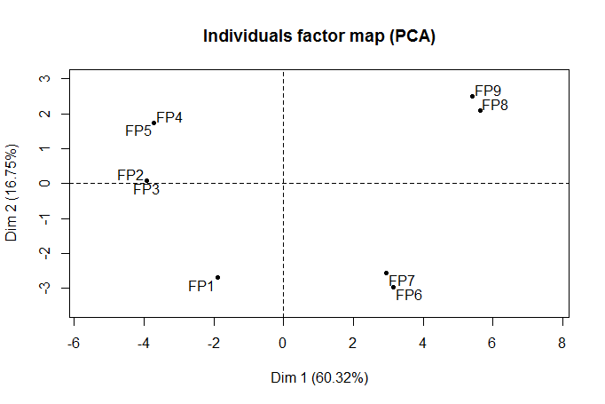

### MaBoSS simulations

MaBoSS is a C++ software for simulating continuous/discrete time Markov processes, defined on the state transition graph describing the dynamics of a Boolean network and can output probabilities of activation for each state of the model. This allows quantification of genetic perturbation and epistatic studies: simulation results do not shift from one stable state to another but rather 40% of the simulations shift from one stable state to another. 

In order to have these software running we need its source code that can be downloaded from [http://maboss.curie.fr/](http://maboss.curie.fr/) and compile it on a UNIX machine. In order to be able to compile MaBoSS, packages flex and bison are needed and in order to use our scripts a Perl interpreter is needed.

Once you have an executable you can copy it to the location of our launching script PlMaBoSS.pl and run it on a command line stating the name of the BND and CFG files:

	./PlMaBoSS_2.0.pl ginsim_out.bnd ginsim_out2.cfg

This launching script generates a folder with the BND and CFG files as well as the resulting files with the same prefix as the BND and CFG files. These files are: 

* FP TXT file, where all fixed points are described

* probtraj CSV file, with all the network state probabilities on a time window, the entropy, the transition entropy and the Hamming distance distribution

* probtraj_table CSV file, which is the previous file rearranged

* run TXT file, with a summary of the MaBoSS simulation run 

* statdist CSV file, with stationary distribution characterizations

* statdist_table CSV file, which is the previous file rearranged 

In order to analyse the results we have built a small script to rearrange the columns so to have the more probable states on the leftmost columns. For this, we apply results_postprocess script to probtraj_table CSV file such as:

	./results_postprocess.sh ginsim_out_probtraj_table.csv

This creates a file called ginsim_out_probtraj_table_post.csv that we can import on our favourite spreadsheet software and plotting the leftmost stable states columns gives something like:

This plot displays temporal evolution of the four most probable trajectories. As we can see most probable stable state is Apoptosis and Cell Cycle Arrest, followed by Migration, EMT and Cell Cycle Arrest, followed by the Homeostatic state (labelled as <nil> and with only CDH1 active) and lastly EMT and Cell Cycle Arrest. 

**XXX A paragraph on populations studies with pie charts**

## Model reduction

**XXX Why reductions**

1. Masking nodes reduction using GINsim

The list of the stable states of the full detailed model is shown below:

First two columns, ECMicroenv and DNAdamage are the inputs of the system and the following six are outputs: ECM, Invasion, Migration, Metastasis, Apoptosis and CellCycleArrest.

We select the variables we wish to keep in the reduced version of the model and 

Go to Tools => Reduce model

Choose the variables to suppress, nodes that we want to remove. Please bear in mind that this should not be done on self-regulated nodes.

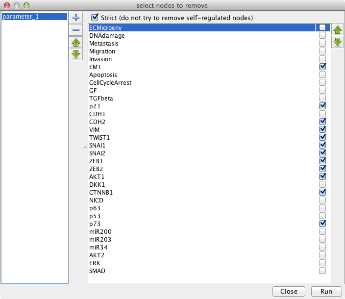

The resulting network is the following:

New edges, with blue colour, represent reduced paths, combination of two or more edges in the original network.

The resulting logical rules are not written explicitly but the conditions for activations are available as a list of parameters. 

The resulting stable states can be obtained and we can see that the transfer function of inputs and outputs have been conserved, same combinations of inputs lead to same combination of outputs:

2. Modular reduction using BiNoM

Another way to reduce the model is by collapsing a set of neighbouring nodes into one module. 

This method is semi-manual and requires some decision-making from the modeller.

For that, we use BiNoM functionalities. The method for reduction was already presented in [ref], where the rationale behind choices on rules was explained. With this method, some choices of which rules are important need to be made like when both positive and negative influences are deduced from one module to another.

The obtained network is presented below:

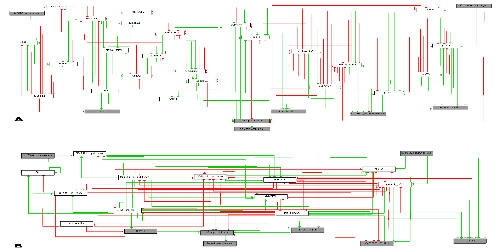

with the corresponding rules:

<table>
  <tr>
    <td>Node</td>
    <td>Rule</td>
  </tr>
  <tr>
    <td>AKT1</td>
    <td>WNT_pthw & (Notch_pthw | TGFb_pthw | GF | EMTreg) & !miRNA & !p53 & !Ecadh</td>
  </tr>
  <tr>
    <td>AKT2</td>
    <td>(TGFb_pthw | GF | Notch_pthw | EMTreg) & EMTreg & !miRNA & !p53</td>
  </tr>
  <tr>
    <td>Ecadh</td>
    <td>!AKT2 & !EMTreg</td>
  </tr>
  <tr>
    <td>WNT_pthw</td>
    <td>!Notch_pthw & !EMTreg & !miRNA & !p53 & !p63_73 & !AKT1 & !Ecadh & !WNT_pthw</td>
  </tr>
  <tr>
    <td>ERK_pthw</td>
    <td>(TGFb_pthw | Notch_pthw | GF | EMTreg) & !AKT1</td>
  </tr>
  <tr>
    <td>GF</td>
    <td>(GF | EMTreg) & !Ecadh</td>
  </tr>
  <tr>
    <td>miRNA</td>
    <td>(p53 | p63_73) & !AKT2 & !EMTreg & !AKT1</td>
  </tr>
  <tr>
    <td>Notch_pthw</td>
    <td>ECMicroenv & !p53 & !p63_73 & !miRNA</td>
  </tr>
  <tr>
    <td>p53</td>
    <td>(Notch_pthw | DNAdamage | WNT_pthw) & !AKT1 & !AKT2 & !p63_73 & !EMTreg</td>
  </tr>
  <tr>
    <td>p63-73</td>
    <td>!Notch_pthw & !p53 & DNAdamage & !AKT2 & !AKT1 & !EMTreg</td>
  </tr>
  <tr>
    <td>TGFb_pthw</td>
    <td>(Notch_pthw | ECMicroenv) & !WNT_pthw & !miRNA</td>
  </tr>
  <tr>
    <td>EMTreg</td>
    <td>(Notch_pthw | WNT_pthw | EMTreg) & !miRNA & !p53</td>
  </tr>
  <tr>
    <td>CCA</td>
    <td>(((p53 | p63_73 | (TGFb_pthw & Notch_pthw) | AKT2) & !ERK_pthw) | miRNA | EMTreg) & !AKT1</td>
  </tr>
  <tr>
    <td>Apoptosis</td>
    <td>!ERK_pthw & !AKT1 & !EMTreg & (miRNA | p63_73 | p53)</td>
  </tr>
  <tr>
    <td>EMT</td>
    <td>!Ecadh & EMTreg</td>
  </tr>
  <tr>
    <td>Invasion</td>
    <td>(TGFb_pthw & EMTreg) | WNT_pthw</td>
  </tr>
  <tr>
    <td>Migration</td>
    <td>EMT & ERK_pthw & AKT2 & Invasion & !AKT1 & !miRNA & !p63_73</td>
  </tr>
  <tr>
    <td>Metastasis</td>
    <td>Migration</td>
  </tr>
</table>

## Mutant analysis

One of the reasons to be interested in model construction is the possibility to study genetic perturbations and how they affect phenotypes. As our nodes correspond to genes or sets of genes, it is easy to have an automated construction of models with perturbed genes and be able to simulate them. This allows us to be able to compare different mutant models and combinations of perturbations, thus enabling epistasis studies, and perform also robustness analyses..

1. Predicting genetic interactions

We use MaBoSS in order to explore an epistasis study of the genes in our network.

For this, we need several files, such as: 

* BiNoM_all.jar

* MaBoSS executable (MaBoSS-1-3-8 for UNIX and MaBoSS.exe for Windows)

* VDAOEngine.jar

* BND file

* CFG file

* `1_generating_mutants` script

* `2_running_MaBoSS` script

* `3_results_table` script

* `4_epistasis_study` script

* `Epistasis_Metastasis` script (bundles scripts 1 to 4 in one)

* `preprocess.pl` (dependency of Epistasis_Metastasis script)

We run the analysis in three parts: firstly, we generate all mutants; secondly, we run MaBoss instances for these; thirdly, we bundle the results on a table and finally, we analyse genetic interactions among mutants.

1 Generating all desired mutants

The goal is to build a folder with files corresponding to the different knock out (KO) and over expression (or ectopic expression, OE) mutants for each node. For this, we use MaBoSSConfigurationFile script from BiNoM JAR file. At the end, this script also builds a script (BAT and SH) to run MaBoSS simulations with all these files. The command line to perform this analysis is:

    java -cp ./BiNoM_all.jar fr.curie.BiNoM.pathways.MaBoSS.MaBoSSConfigurationFile -c ./ginsimout2.cfg -b ./ginsimout.bnd

Where `-classpath` is the location of the JAR file, `-c` is the CFG file location and `-b` is the BND file location. Other optional arguments are:

	-single		only single mutants
	-double		only double mutants
	-onlyko		only studies KO mutants, does not study OE mutants
	-exclude PHENOTYPE, PHENOTYPE	excludes study of given phenotypes

2 Running MaBoSS

The goal is to execute the running script SH or BAT file in order to have one MaBoSS run per mutant combination, such as:

	./run.sh

3 Build a table with all MaBoSS results

The goal is to build a table that gathers all the results from all the ProbTraj files done by the previous MaBoSS runs. For this we use MaBoSSProbTrajFile function from BiNoM JAR file.

The command line to perform this analysis is:

	java -Xmx6000M -cp './BiNoM_all.jar:./VDAOEngine.jar' fr.curie.BiNoM.pathways.MaBoSS.MaBoSSProbTrajFile 
	-maketable -folder ginsimout2_mutants/ -prefix ginsimout2_ -out ginsimout2.xls

Where `-classpath` is the location of the JAR files, `-maketable` is the command to build the results’ table (in a tab-delimited file and a ViDaExpert table file), `-folder` is the location of the folder with ProbTraj files, -prefix is the name of the files’ prefix (usually a descriptive name for the model) and -out is the desired output file name.

4 Normalize MaBoSS results

The goal is to normalize the results obtained with MaBoSS using MaBoSSProbTrajFile function from BiNoM JAR file.

The command for this is:

	java -Xmx6000M -cp './BiNoM_all.jar:./VDAOEngine.jar'  fr.curie.BiNoM.pathways.MaBoSS.MaBoSSProbTrajFile 
	-normtable -table ginsimout2.xls 

Where `-classpath` is the location of the JAR files, `-normtable` is the normalization command that filters lower bounds of 1% in the probability table and -table is the name of the data table that results from `-maketable` command (tab-delimited or DAT file).

5 Analyse genetic interactions

The goal is to study genetic interactions among mutants using MaBoSSProbTrajFile function from BiNoM JAR file.

The command for this is:

	java -Xmx4000M -cp './BiNoM_all.jar:./VDAOEngine.jar'  fr.curie.BiNoM.pathways.MaBoSS.MaBoSSProbTrajFile 
	-makeinter -table ginsimout2_norm.dat 
	-phenotype CellCycleArrest -phenotype_short CCA -out ginsimout2

Where `-makeinter` is the command to build the table of interactions with correlation values and alpha values (look at ref XXX for details), `-table` is the name of the data table that results from `-normtable` command (only DAT file), `-phenotype` is the name of the phenotype in the DAT file (in this case, Survival or Apoptosis or NonACD), `-phenotype_short` is the short name for the phenotype in the output file (in this case, survival OR apoptosis OR necrosis) and `-out` is the name of the output file. Other optional arguments such as `-makelogicmutanttable` and `-description` will be used in the robustness analysis.

This command outputs different kind of files:

* edges, a Cytoscape format file with the epistasi values between combinations of mutants

* nodes, a Cytoscape format file with wild-type phenotype changes in in single mutants

* epi, a descriptive table with the best epistasis results (EPS_BEST)

All edges, nodes and epi files, as well as the folder with mutant files and MaBoSS results are located at ginsimout2epistasis folder.

Alternatively, we have bundled this altogether in one single wrapping script that performs all these commands together. It may be good as an idea how to pipe all these processes together, but unadvised to researchers that want to study different arguments and characteristics.

	./epistasis.sh BND_file.bnd CFG_file.cfg

Which uses a script that studies the model in BND format with the configuration determined in CFG format.

It creates a folder for the run of the epistasis study (so that several runs can be made without overwriting files).

It creates all configuration files with all knock outs and overexpressions of all genes (unless some argument has been invoked).

It runs MaBoSS on all configuration files and BND file.

It builds a results table with all MaBoSS runs.

It normalizes the results with the WT values. It also re-organizes outputs so to bundle together similar outputs.

It performs the epistasis study and outputs all three file types: edges, nodes and epi

## Robustness analyses

For this, we need several files, such as: 

* BiNoM_all.jar

* MaBoSS executable (MaBoSS-1-3-8 for UNIX and MaBoSS.exe for Windows)

* VDAOEngine.jar

* BND file

* CFG file

* `1_generating_variants` script

* `2_running_MaBoSS` script

* `3_results_table` script

* `4_dist_tables` script

Similarly to the "Predicting genetic interactions" section, we first built model variants, then simulate them, gather their results and, finally, analyse them.

1 Generating all desired mutants

The goal is to build a folder with files corresponding to the different logical gates mutants for each node formula. We built variant models with 3 modifications: (1) one change of a logical operator in one logical rule, (2) two changes in the same logical rule, or (3) one single change in two different logical rules. In machine power allows, of course, more changes can be envisaged. The total number of different models that are generated in 8001. For this, we use MaBoSSBNDFile script from BiNoM JAR file. At the end, this script also builds a script (BAT and SH) to run MaBoSS simulations with all these files. The command line to perform this analysis is:

	java -cp ./BiNoM_all.jar fr.curie.BiNoM.pathways.MaBoSS.MaBoSSBNDFile 
	-c ./metastasis.cfg -b ./metastasis.bnd -level 2 -several

Where `-cp` is the classpath or location of the JAR file, `-c` is the CFG file location and `-b` is the BND file location. Several paths to CFG files can be glued together using '+' symbol and, in this case, several command lines per one model variant will be generated. Other optional arguments are:

	-level		can be either 1 (for making only one modification in a logical rule) 
				or 2 (for making 2 modifications). Default value is 1.
	-several	modifier for -level 2 option. If specified, then two logical rules 
				can be applied for two different rules, if not then two modifications 
				will be applied only inside the same rule.

The result of this command line application is a folder named `{BND_file_name}_mutants_logics` that bears all BND model variants, `run.bat` and run.sh files for running the MaBoSS calculations and descriptions.txt file containing descriptions of the generated model variants.

This can be run with script `1_generating_variants`.

2 Running MaBoSS

The goal is to execute the running script SH or BAT file in order to have one MaBoSS run per mutant combination, such as:

	./run.sh

This can be run with script `2_change_run2_sh`. Alternatively, we can use script `1&2_variants_and_run` to perform two previous steps.

3  Gathering the results in tables

We will use the 3\_results\_table script to organize the results of MaBoSS and the mutants’ stable states.

* Build a table with all MaBoSS results 

The goal is to build a table that gathers all the results from all the ProbTraj files done by the previous MaBoSS runs. For this we use MaBoSSProbTrajFile function from BiNoM JAR file.

The command line to perform this analysis is:

	java -cp './BiNoM_arnau2.jar:./VDAOEngine.jar' fr.curie.BiNoM.pathways.MaBoSS.MaBoSSProbTrajFile 
	-makelogicmutanttable -folder metastasis_mutants_logics/ 
	-prefix metastasis -out metastasis.xls -description metastasis_mutants_logics_2/descriptions.txt

Where `-classpath` is the location of the JAR files, `-makelogicmutanttable` is the command to build the results’ table (in a tab-delimited file and a ViDaExpert table file), `-folder` is the location of the folder with ProbTraj files, `-prefix` is the name of the files’ prefix (usually a descriptive name for the model) and -out is the desired output file name.

This command outputs the file metastasis.xls that describes all variants final phenotypes.

* Build a table with stable states for all mutants

The goal is to build a table that gathers all the final stable states and their frequencies from all the StatDist files done by the previous MaBoSS runs. For this we use `MaBoSSStatDistFile` function from BiNoM JAR file.

The command line to perform this analysis is:

	java -cp './BiNoM_arnau2.jar:./VDAOEngine.jar'  fr.curie.BiNoM.pathways.MaBoSS.MaBoSSStatDistFile 
	-maketable -folder metastasis_mutants_logics/ -prefix metastasis

Where `-classpath` is the location of the JAR files, `-maketable` is the command to build the table with all final stable states reached by each mutant (in a tab-delimited file and a ViDaExpert table file), -folder is the location of the folder with StatDist files and `-prefix` is the name of the files’ prefix (usually a descriptive name for the model).

This command builds a tab-delimited file with name `{prefix}_dist_mutants_count.txt` where each stable state for each mutant can be found. 

4 Organize stable states’ frequency and calculate Hamming distance among stable states

FIrst, we will find the Hamming distance of each variant stable states to the wild type and next we will organize the table, to find the more frequent stable states.

The command used is:

	./4_dist_tables.sh metastasis

Where second term should be the same as `-prefix` option in the previous java call. This script uses a Perl routine on the `hamm_dist.pl` file that will be needed to be located on the same folder.

This command outputs two a tab-delimited files: one is `{prefix}_dist_mutants_WTdist.txt` that describes all stable states and their Hamming distance to wild type states and `{prefix}_counts_sorted.txt` that sorts the table to find the most frequent stable states.

#### Robustness analysis with respect to the phenotype probability

Using the file metastasis.xls we can explore the robustness of the rules with respect to the phenotype probabilities. 

For the example, we choose to show the result of one of the phenotypes, *Metastasis*. The wild type probability for the phenotype is around 23%. We plot the number of models for which the probability varies. We see below that a high proportion of variants do not change the probability but a significant number of models drop the probability to 0%. We can explore this with histograms or violins plots in order to compare different phenotypes’ distributions. Log conversion of phenotype probabilities and normalization by wild type probability is very useful to make this cross-phenotypes. This can be traced in metastasis\_histogram.xlsx and histogram.R file or on any other data processing software you like.

Looking closely at the *Metastasis*’ phenotypes changes that lead to 0% of metastasis, we can see that changing the logical operators of p63, p73 or AKT1 rules alter the wild type. A particular attention needs to be given to these variables whose rules need to be carefully constrained. 

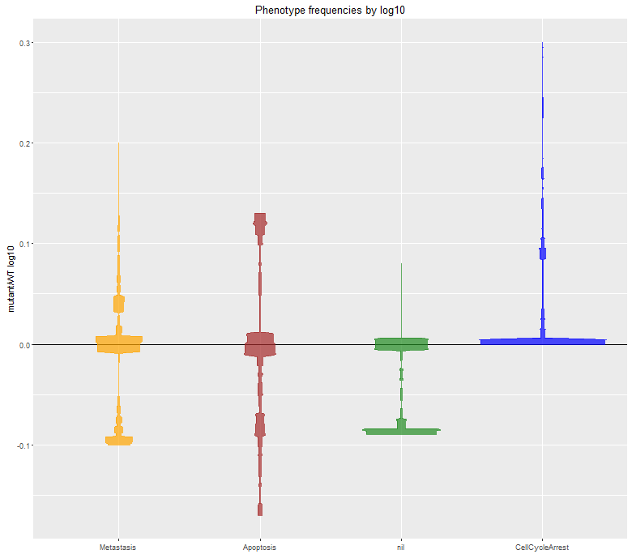

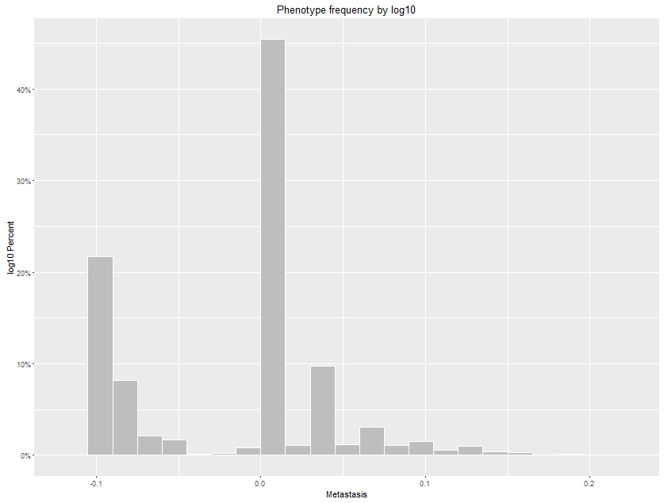

These two could substitute this one:

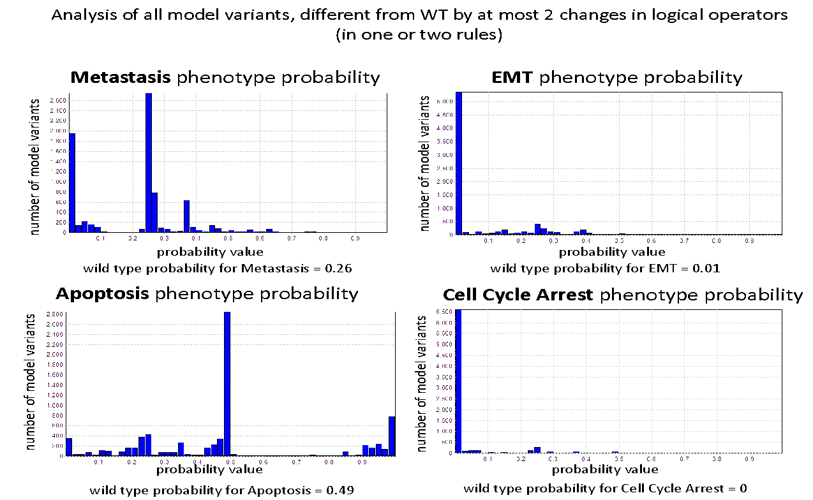

Fig Histogram

Fig Histogram

#### Robustness analysis with respect to the stable states

Using the file `metastasis_dist_mutants_WTdist.xls` or `metastasis_counts_sorted.txt` we can explore the frequency of stables states and their distance to the wild type probabilities. 

The wild type is composed of 9 stable states showing 4 different phenotypes: HS (for homeostatic state), *Apoptosis*, *EMT *and *Metastasis*. By listing all the stable states for all the 8001 variants, we observe that in average, the variants have also around 8 or 9 stable states. Note that the 8 or 9 stable states of the variants might not be the same as the wild type. Among all these stable states, we searched for differences between the stable states of the wild type to the stable states of the variants. We computed the Hamming distance of all the variants’ stable states to the 9 stable states of the wild type. 

We found that the nine stable states of the wild type are robust to changes in the logical operators. The stable states that differ the most (DIST\_TO\_WT=12) are the results of changes occurring in CTNNB1 or NICD logical rules.

## Using the model as a scaffold for data integration

### Mapping data onto modular network using ROMA

**XXX Laurence: supply cytoscape session file?**

How we have used ROMA to knit the colon cancer patients treated with cetuximad data on the genes networks and on the modules networks.

Gene-wise: using Cytoscape and the gene expression file.

Module-wise: how are gene scores bundled ?

### Using data as priors of model construction

#### LemonTree tool

**XXX recipe**

#### ROMA tool

**XXX recipe**

